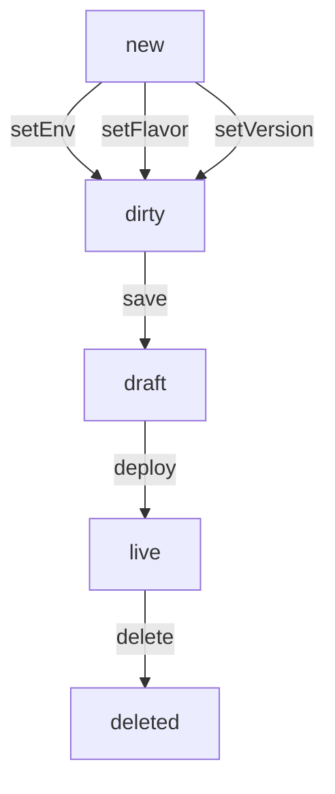

# Automium-SDK

## Usage

```
const SDK = require('automium-sdk')
const client = new SDK.Client("https://AUTOMIUM_ENDPOINT")

client.login("username","password").then(res => {
    console.info("is user logged in:",res)
})

const infra = client.infra("default")
infra.specs(SDK.Environment.DRAFT).then(data => {
    data.forEach(svc => {
        ...
    })
})
...
```

## Concepts

Infra **Specs** = source of record. A list of how infrastructure services should be.

Infra **Services** and **Status** = source of truth. A list of created services and the related expected nodes in the infrastructure.

## Service Lifecycle

The service lifecycle starts with the command:
`let svc = infra.addService("service-name")`



## Infra Lifecycle

TBD