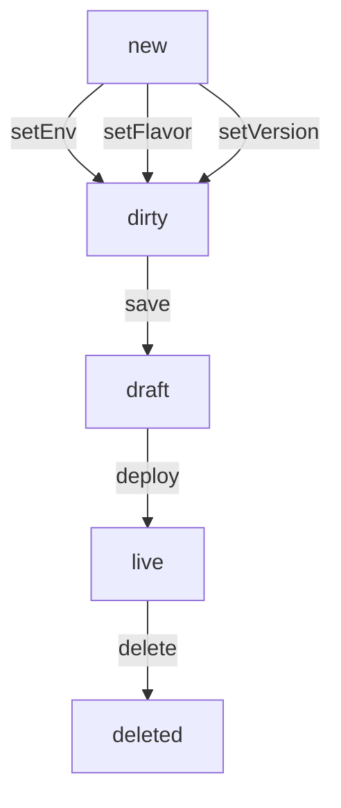

# Automium SDK

[](https://travis-ci.org/automium/automium-sdk)
[](https://www.npmjs.com/package/automium)

## Usage

```
const SDK = require('automium')
const client = new SDK.Client({
    baseUrl: "https://AUTOMIUM_ENDPOINT",
    auth: "token"
})

Instead of passing a valid token, you can use the login function:

client.login("username","password").then(res => {
    console.info("is user logged in:",res)
})

const infra = client.infra("default")
infra.specs(SDK.Environment.DRAFT).then(data => {
    data.forEach(svc => {
        console.info("service:", svc.metadata)
        console.info("count:", svc.spec.replicas)
        ...
    })
})
...
infra.status().then(data => {
    data.items.forEach(node => {
        console.info("hostname:",node.spec.hostname)
        console.info("address:",node.status.nodeProperties.address)
        console.info("hc:", node.status.nodeHealthChecks)
        ...
    })
})
...
infra.services().then(data => {
    data.forEach(svc => {
        console.info(svc.data.metadata.name)
        ...
    })
})
```

## Concepts

Infra **Specs** = source of record. A list of how infrastructure services should be.

Infra **Services** and **Status** = source of truth. A list of created services and the related expected nodes in the infrastructure.

## Service Lifecycle

The service lifecycle starts with the command:
`let svc = infra.addService("service-name")`



## Infra Lifecycle

TBD

## License

MIT
